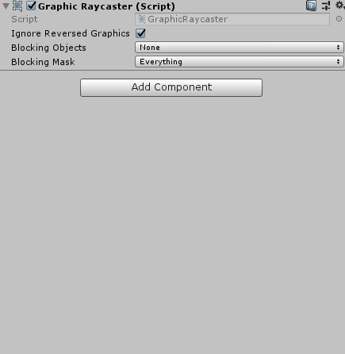

# Mocha
>  Mocha is a Unity Extension.Mocha allows you can create smooth,simple UI animations in Unity.This package includes full C# Code of this project.

## How can i use this package?

``` 
Just Add Mocha Component To Any UI Element (Button , Text etc..) 
You Can Play With The Values To Make Your Animation.
```  

